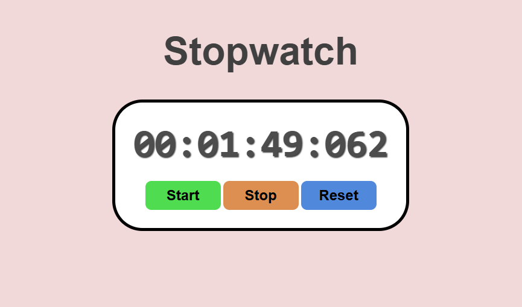

# Stopwatch Program

A simple functional stopwatch program built with html, css and js. Users can start, stop and reset time with a clean responsive display. 

## Features 

- **Start**: Users can start timer from the current elapsed time.
- **Stop**: Users can stop timer whenever he wants.
- **Reset**: Users can reset the timer to its default position. 

## Demo



## Installation

1. Clone the repository
    ```bash
    git clone https://github.com/abualmueid/learn-js.git

2. Navigate to the project directory
    ```
    cd BroCode/projects/8-stopwatch_program 

3. Open the `index.html` file in your browser to run the stopwatch. 

## Usage 

- **Start**: Hit the 'start' button to start the stopwatch.
- **Stop**: Hit the 'stop' button to stop the stopwatch.
- **Reset**: Hit the 'reset' button to reset the stopwatch.

## Contributing

Contributions are welcome! If you have any suggestions or improvements, feel free to open an issue or submit a pull request.

## License

This project is licensed under the [MIT License]().

## Author

**Abu Al Mueid**   
Here is my [GitHub Profile](https://github.com/abualmueid)