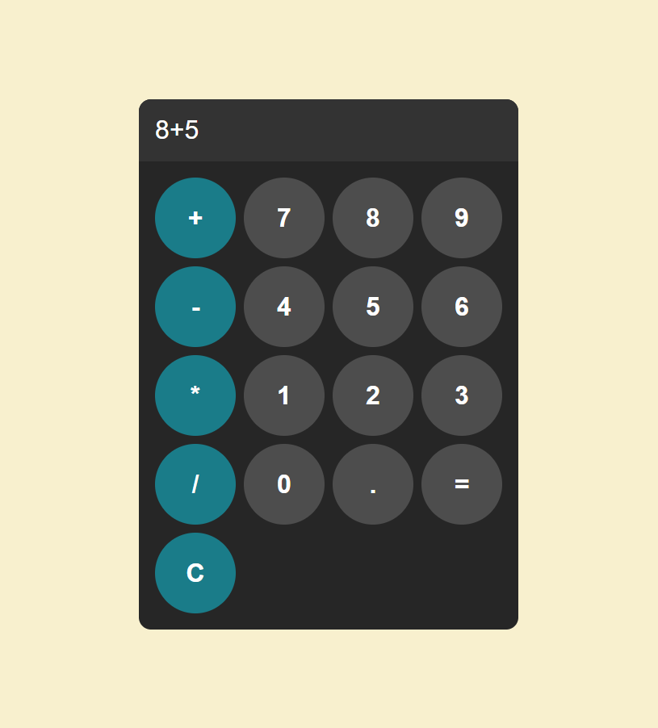

# Calculator Program

A simple functional calculator program built with html, css and js. User can easily calculate values with the buttons included.

## Features 

- **Display**: User can see the calculated value in the display bar.
- **Keys**: User can press the keys from 0 to 9 including dot (.).
- **Operator Button**: User can use the operator buttons to add, subtract, multiply and divide values.
- **Reset Button**: User can reset the value in the display bar whenever he wants.

## Demo



## Installation

1. Clone the repository
    ```bash
    git clone https://github.com/abualmueid/learn-js.git

2. Navigate to the project directory
    ```
    cd BroCode/projects/9-calculator_program 

3. Open the `index.html` file in your browser to run the calculator.

## Usage 

- **Display**: You will see the result in the display bar above the keys.
- **Keys**: Press the keys to calculate some values.
- **Operator Button**: Use the operator buttons (+, -, *, /) to add, subtract, multiply and divide values.
- **Reset Button**: You can reset the value to do some more operations again.

## Contributing

Contributions are welcome! If you have any suggestions or improvements, feel free to open an issue or submit a pull request.

## License

This project is licensed under the [MIT License]().

## Author

**Abu Al Mueid**   
Here is my [GitHub Profile](https://github.com/abualmueid)